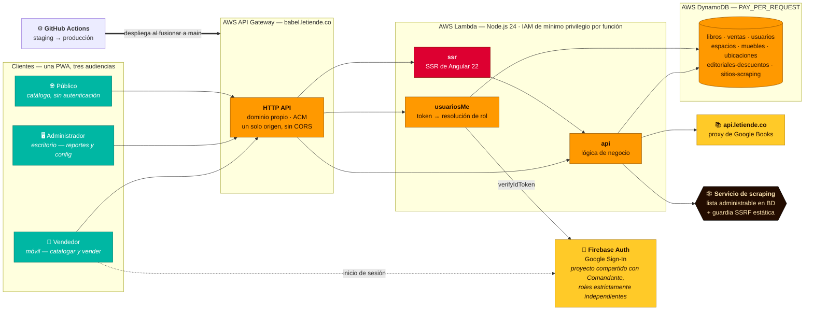

<div align="center">

# Babel

**Sistema de inventario y punto de venta en producción para una librería — arquitectado mediante orquestación de agentes IA, instrumentado tarea por tarea, y entregado con un reparto de esfuerzo 20/80 entre humano y agente.**

[](https://babel.letiende.co)
[](https://angular.dev)
[](https://aws.amazon.com)
[](https://serverless.com)
[](#entrega-instrumentada)
[](#el-canal-móvil)
[](./README.md)

</div>

---

## Resumen ejecutivo

> **Un sistema en producción entregado en 19 días calendario sobre 43 horas de trabajo medido — de las cuales el 20,8% fue humano.**

Babel es el sistema de catalogación, ubicación y venta de la librería de **Le Tiende**, centro cultural en Bogotá, Colombia. Resuelve el escaneo de códigos de barras ISBN con enriquecimiento automático de metadatos, la ubicación física en una jerarquía de tres niveles, la venta en tienda, un catálogo público con SSR, y un back office administrativo con reportería financiera en XLSX.

| | |
| :-- | :-- |
| **Tiempo al mercado** | **19 días calendario** — primer commit `16/07/2026` → producción `03/08/2026` |
| **Esfuerzo medido** | **43 h 11 m** en 149 tareas rastreadas individualmente, 16 días activos |
| **Reparto humano / agente** | **20,8% humano · 79,2% agente** — [la razón de Pareto, medida, no estimada](#entrega-instrumentada) |
| **Superficie de orquestación** | **37,1% dirigido desde un celular** — despacho, revisión y fusión, en movimiento |
| **Método** | AI-Augmented SDLC — orquestación de agentes como método principal de producción |
| **Cadencia de entrega** | 269 commits · 84 pull requests fusionados · ~26 K LOC de aplicación · ~3 K LOC de IaC |
| **Humano en el ciclo** | 100% de las fusiones a `main` revisadas y aprobadas por un humano |
| **OPEX mensual** | Menos de **US$1/mes** en costo variable — tras corregir un incidente real de facturación de US$94 |

La afirmación no es que una IA escribió el código. La afirmación es que **un arquitecto de soluciones orquestando agentes comprimió el ciclo de vida completo** — requerimientos, arquitectura, especificación, implementación, revisión de seguridad, despliegue y respuesta a incidentes — a una fracción del tiempo de entrega convencional, e **instrumentó cada tarea lo suficientemente bien como para demostrar a dónde se fue el tiempo realmente**.

---

## El problema

La librería de Le Tiende tenía un inventario de **más de 3.000 libros físicos** y ningún sistema. Sin catálogo, sin mapa de ubicación, sin registro de ventas, sin saber cuánto costó un título, en cuánto se vende, ni en qué estante está. Un cliente preguntando "¿tienen este libro?" disparaba una búsqueda manual por los estantes.

Cualquier solución tenía que sobrevivir el caso de uso fundacional: **una persona catalogando 3.000 libros a mano**. Eso convierte el flujo de catalogación en la ruta crítica de rendimiento de todo el sistema — cada toque de más se multiplica por tres mil.

## La solución

Una PWA responsive, mobile-first para el piso de la tienda y desktop para administración.

### Catalogación — la ruta crítica
Se escanea el código de barras ISBN con la cámara del celular. El sistema resuelve los metadatos (título, autor, portada, editorial) contra un proxy interno de Google Books, y cae a scraping sobre una lista de sitios administrable para recuperar el precio de venta al público. Todo llega **precargado y editable** — el dato automático es una sugerencia, nunca un compromiso.

### Ubicación física
Jerarquía de tres niveles — **espacio → mueble → ubicación** — para que "¿dónde está este libro?" tenga una respuesta literal. Los muebles llevan códigos QR impresos, generados por una herramienta acompañante en [`tools/qr-muebles/`](./tools/qr-muebles).

### Venta
Registro de venta desde la ficha del propio libro en pocos toques, con descuento editorial aplicado automáticamente y soporte de descuento por venta.

### Catálogo público
Renderizado en servidor, sin autenticación, indexable, con ficha propia por libro y filtrado por ubicación.

### Administración
Usuarios, distribución física, descuentos editoriales, lista de sitios de scraping, y exportación XLSX para reportes de ventas e inventario.

---

## Arquitectura



**Las decisiones que sostienen el sistema:**

1. **La autorización nunca sale del servidor.** Los guardias de ruta de Angular son solo experiencia de usuario. Cada petición protegida verifica el ID Token de Firebase y resuelve el rol consultando `babel-usuarios` con el correo *del token*. Un rol enviado en el payload se ignora por construcción. Aquí importa más de lo habitual: el proyecto de Firebase es **compartido con [Comandante](https://github.com/ocastelblanco/comandante-letiende)**, así que tener cuenta —o rol de administrador— en la app hermana no otorga absolutamente nada en Babel.

2. **El SSRF se blinda estáticamente, no con la lista blanca.** La lista de sitios de scraping es dato editable por el administrador, así que no puede ser la frontera de seguridad. Toda URL saliente pasa por una guardia fija (`esUrlSegura`, en [`server/api/services/scraping.ts`](./server/api/services/scraping.ts)) que exige HTTPS y valida que el hostname resuelva a una IP pública —rechazando rangos privados, loopback y link-local, incluido el endpoint de metadatos `169.254.169.254`— y revalida en cada redirección vía `redirect: 'manual'`.

3. **Un solo origen, dos Lambdas.** SSR y API comparten dominio detrás de un único HTTP API, lo que elimina CORS por completo y reduce la superficie de seguridad a un solo borde.

4. **Mínimo privilegio por función.** Cada Lambda tiene su propio rol IAM acotado a las tablas que efectivamente toca — no un rol de servicio compartido.

---

## Entrega instrumentada

Esta es la parte que distingue este proyecto de una construcción rápida.

**Cada tarea de este proyecto — humana o de agente, de planeación o de ejecución — es una fila en [`tracking-detail.csv`](./tracking-detail.csv).** No es un resumen escrito después: es una fila agregada en el momento en que la tarea cerró, con la hora de inicio capturada antes de empezar el trabajo.

La instrumentación no es un hábito, es **una regla codificada en el repositorio**. [`CLAUDE.md` §8](./CLAUDE.md) obliga a toda sesión de agente a capturar `TZ=America/Bogota date` al iniciar, capturarla de nuevo al terminar, y agregar la fila. El sistema de medición se mantiene solo porque es parte de las instrucciones operativas del agente, no de la disciplina de nadie.

Diez columnas por fila: `stage · start · finish · time · role · model · milestone · tool · device · effort`.

**149 filas. 43 h 11 m. 16 días activos**, medidos con corte al lanzamiento a producción del `03/08/2026`. Lo que sigue es ese archivo, agregado — nada aquí es una estimación. El archivo sigue creciendo; los agregados de abajo son una foto de esa fecha.

### La razón de Pareto, medida

| Esfuerzo | Humano | Agente | Total | Peso |
| :--- | ---: | ---: | ---: | ---: |
| **high** | 7:47:00 | 31:14:00 | **39:01:00** | 90,4% |
| **medium** | 0:46:00 | 1:47:30 | **2:33:30** | 5,9% |
| **low** | 0:25:30 | 1:11:00 | **1:36:30** | 3,7% |
| **TOTAL** | **8:58:30** | **34:12:30** | **43:11:00** | 100% |
| **Peso** | **20,8%** | **79,2%** | | |

**20,8 / 79,2.** El reparto cayó a menos de un punto porcentual de la razón de Pareto sin que nadie lo buscara — y ahí está lo interesante, porque ese 20% no se distribuye parejo. Se concentra aguas arriba:

| Dónde se fueron las 8h58m humanas | Tiempo | Peso del esfuerzo humano |
| :--- | ---: | ---: |
| Especificación y requerimientos | 4:10:00 | **46,4%** |
| Revisión y ajuste visual de frontend | 2:51:30 | 31,8% |
| Revisión de backend | 1:07:00 | 12,4% |
| Infraestructura cloud | 0:33:00 | 6,1% |
| Auth, workspace y scaffold | 0:17:00 | 3,2% |

Casi la mitad del tiempo humano se fue en **definir el problema** — y solo el 3,2% en scaffolding, cableado y setup, que es exactamente el trabajo que debe delegarse. El apalancamiento del arquitecto no está en escribir menos código; está en el 20% de decisiones que determinan el otro 80% del resultado.

### Esfuerzo y canal de desarrollo

| Esfuerzo | CLI | Móvil | Web | Escritorio | Total |
| :--- | ---: | ---: | ---: | ---: | ---: |
| **high** | 24:35:00 | 14:19:00 | 0:07:00 | 0:00:00 | **39:01:00** |
| **medium** | 1:34:30 | 0:52:00 | 0:07:00 | 0:00:00 | **2:33:30** |
| **low** | 0:31:30 | 0:51:00 | 0:11:00 | 0:03:00 | **1:36:30** |
| **TOTAL** | **26:41:00** | **16:02:00** | **0:25:00** | **0:03:00** | **43:11:00** |
| **Peso** | **61,8%** | **37,1%** | **1,0%** | **0,1%** | |

### Esfuerzo por etapa del ciclo de vida

| Etapa | Total | Peso | Agente | Humano | Tareas |
| :--- | ---: | ---: | ---: | ---: | ---: |
| Frontend | 11:41:30 | 27,1% | 8:50:00 | 2:51:30 | 49 |
| Especificación | 10:28:00 | 24,2% | 6:18:00 | 4:10:00 | 20 |
| Backend | 10:06:00 | 23,4% | 8:59:00 | 1:07:00 | 33 |
| Infraestructura cloud | 8:09:00 | 18,9% | 7:36:00 | 0:33:00 | 24 |
| Configuración de workspace | 1:40:30 | 3,9% | 1:33:30 | 0:07:00 | 17 |
| Scaffold | 0:40:00 | 1,5% | 0:39:00 | 0:01:00 | 2 |
| Integración de autenticación | 0:26:00 | 1,0% | 0:17:00 | 0:09:00 | 4 |

**La especificación es la segunda etapa más cara de todo el proyecto** — más que la infraestructura cloud, casi tanto como el backend completo. En un proyecto llevado convencionalmente esa proporción parecería desperdicio. Aquí es la causa de los demás números: la especificación es lo que hace que la salida de un agente sea revisable en minutos en vez de re-derivable desde cero.

### El enrutamiento de modelos como decisión de costo

| Modelo | Tiempo | Peso del esfuerzo de agente |
| :--- | ---: | ---: |
| Sonnet 5 | 32:36:30 | 95,3% |
| Fable 5 | 0:32:00 | 1,6% |
| Opus 4.8 | 0:30:00 | 1,5% |
| Opus 5 | 0:29:00 | 1,4% |
| Kimi 3 | 0:05:00 | 0,2% |

El 95% del trabajo de agente corrió sobre el modelo de gama media. Los modelos de frontera se reservaron para las dos cosas que realmente los requerían — verificación arquitectónica y el análisis de causa raíz de una condición de carrera real. **Enrutar es una decisión de ingeniería con una línea de factura**, y rastrearla por tarea es lo que la vuelve revisable en vez de una cuestión de gusto.

### El canal móvil

**El 37,1% del tiempo total del proyecto se dirigió desde un celular Android** — 14 h 19 m de eso en trabajo de esfuerzo alto, no en trivialidades.

No es una novedad; es lo que la arquitectura permite. Cuando el CI/CD se encarga de construir, desplegar y publicar una URL de staging verificable, el trabajo que le queda al humano es **despachar, juzgar y aprobar** — tres cosas que caben en la pantalla de un celular. Tres precondiciones hacen que el ciclo funcione, cada una una decisión arquitectónica tomada *antes* de la primera tarea:

1. **Un pipeline que produce un artefacto verificable, no un check verde.** Cada fusión despliega a `staging`; verificar es abrir una URL y usar la funcionalidad real.
2. **Un backlog que sostiene el estado para que el operador no tenga que hacerlo.** El motor JIT de [`TODO.md`](./docs/TODO.md) está topado en dos tareas atómicas, así que *"arranca la siguiente tarea"* es una instrucción inequívoca, sin contexto que reconstruir.
3. **Restricciones en el repositorio, no en el prompt.** [`CLAUDE.md`](./CLAUDE.md) carga las reglas de seguridad, las convenciones de código y la política de git. El agente llega pre-restringido, así que tres líneas escritas con el pulgar producen la misma disciplina que un briefing completo.

> **Reproduce estos números.** [`tracking-detail.csv`](./tracking-detail.csv) está commiteado completo. Cada agregado de esta página sale de ahí, y cada fila es auditable contra el historial de git.

---

## AI-Augmented SDLC

La orquestación de agentes fue el **método principal de producción**, aplicado a todo el ciclo de vida — no un autocompletado atornillado a un proceso convencional.

| Fase del ciclo de vida | Cómo se ejecutó |
| :--- | :--- |
| **Requerimientos** | Entrevista estructurada contra las restricciones reales del operador del negocio, antes de cualquier arquitectura |
| **Arquitectura** | Diseño iterativo validado contra límites duros de costo y seguridad, registrado como ADRs en [`tech-specs.md`](./docs/tech-specs.md) |
| **Especificación** | [`PRD.md`](./docs/PRD.md) y [`tech-specs.md`](./docs/tech-specs.md) mantenidos como artefactos vivos — 24,2% del esfuerzo total del proyecto |
| **Planeación** | Backlog JIT con límite duro de 2 tareas atómicas — sin plan rancio, sin estimación obsoleta |
| **Implementación** | Delegada a agentes ejecutores, una rama y un pull request por tarea |
| **Verificación** | Agentes revisores independientes — **el agente que escribe el código nunca lo aprueba** |
| **Seguridad** | OWASP Top 10 mapeado a la superficie de ataque real de este sistema y codificado como restricción permanente en [`CLAUDE.md` §5](./CLAUDE.md) |
| **Flujo de git** | Impuesto por política: los agentes tienen estructuralmente prohibido hacer push a `main` o fusionar cualquier PR |
| **Medición** | Instrumentación por tarea obligatoria para toda sesión de agente ([`CLAUDE.md` §8](./CLAUDE.md)) |

**Las barandas que hicieron segura la velocidad.** La velocidad sin disciplina produce código no revisable. Cuatro restricciones lo mantuvieron honesto:

1. **Ningún agente fusiona su propio trabajo.** Los 84 pull requests fueron revisados y fusionados por un humano.
2. **Las restricciones viven en el repositorio.** [`CLAUDE.md`](./CLAUDE.md) codifica reglas de seguridad, convenciones de código, política de git y la obligación de tracking como instrucciones versionadas, para que el contexto sobreviva entre sesiones, agentes y cambios de modelo.
3. **Un límite WIP de 2.** [`TODO.md`](./docs/TODO.md) nunca sostiene más de dos tareas atómicas.
4. **Una tarea, una rama, un PR, una verificación en staging.** El despliegue al staging compartido está serializado — nunca se abre un segundo PR antes de que el anterior termine de desplegarse.

**El artefacto que compone.** [`MEMORY.md`](./docs/MEMORY.md) y [`CLAUDE.md` §7](./CLAUDE.md) acumulan los comportamientos no obvios del stack descubiertos durante el desarrollo: `getUserMedia` fallando en silencio en iOS Safari si no lo dispara un tap directo; descripciones de función Lambda topadas en 256 caracteres rompiendo un despliegue; URLs de avatar de Google devolviendo HTTP 429 sin `referrerpolicy="no-referrer"`. Cada sesión de depuración se captura una vez y no se vuelve a litigar. **Ese archivo es el verdadero entregable del método — el código es su salida.**

---

## Costo: el incidente de US$94

El proyecto declaró un objetivo de costo de infraestructura de US$0. En julio de 2026 facturó **US$94,44**. Ese número está documentado en este repositorio en vez de corregido en silencio, porque cómo ocurrió es más instructivo que la corrección.

**La causa no fue una falla técnica. Fue una suposición de precio sin verificar, escrita como si fuera un hecho** — en la especificación *y* en un comentario del código:

> `# Capacidad aprovisionada 25/25 en todas (capa siempre gratuita de AWS, objetivo de costo $0, nunca on-demand).`

AWS regala 25 RCU + 25 WCU gratis **por cuenta, no por tabla**. Babel tenía 8 tablas × 2 stages + 2 GSIs = **18 unidades de 25/25 = 450 RCU + 450 WCU**, dieciocho veces la asignación gratuita, con una tasa de **~US$256/mes** — para almacenar 43 registros. Un comentario escrito para *ahorrar* dinero generó la mayor línea de la factura de la cuenta.

| | Antes | Después |
| :--- | ---: | ---: |
| Modo de facturación DynamoDB | `PROVISIONED` 25/25 × 18 | `PAY_PER_REQUEST` |
| Costo proyectado de DynamoDB | ~US$256/mes | **< US$0,10/mes** |
| Costo de Lambda (mes completo, tráfico real) | US$0,00028 | US$0,00028 |

La corrección fue un comando. **La lección fue un cambio de proceso**, hoy documento obligatorio de pre-vuelo para todo proyecto de Le Tiende — [`docs/advertencia-urgente-costos-aws.md`](./docs/advertencia-urgente-costos-aws.md):

- **Nunca escribas una cifra de precio, un "esto es gratis" o un "esto nunca se cobra" que no hayas verificado ese mismo día** — y si no lo verificaste, escribe `SIN VERIFICAR` al lado.
- **Configura la alarma de presupuesto ANTES de desplegar el primer recurso, calibrada *por encima* del piso de costo fijo real de la cuenta.** Un presupuesto mensual de US$4 en una cuenta con ~7 hosted zones de Route 53 (US$3,58/mes fijos) se satura al 89% antes de que exista el proyecto — y entonces un sobrecosto de US$90 es indistinguible del ruido. Este incidente corrió 11 días sin detectarse exactamente por eso.
- **Toda capacidad que se cobra por tiempo y no por uso es un pasivo permanente.** Búscala explícitamente antes de cada despliegue.
- **Antes de eliminar un recurso "sin uso", verifica qué apunta hacia él desde afuera.** Durante la limpieza de este mismo incidente, un stack de CloudFormation que `list-stack-resources` reportaba como sin estado tumbó una API de producción no relacionada por ~15 minutos, vía un mapeo de dominio personalizado que no aparecía en el listado.

Hay aquí un riesgo específico y agravado para los agentes IA, y está escrito en las instrucciones permanentes del proyecto: **el conocimiento de un agente sobre precios de nube está desactualizado por construcción.** La confianza con la que un modelo afirma "25 RCU son gratis" no guarda ninguna relación con que eso siga siendo cierto hoy, en esta cuenta, bajo este modelo de capa gratuita.

### Arquitectura de costo cero

| Servicio | Modo | Costo mensual |
| :--- | :--- | ---: |
| AWS Lambda (`ssr`, `api`, `usuariosMe`) | On-demand, 256 MB | ~$0,00 |
| AWS DynamoDB (8 tablas × 2 stages) | `PAY_PER_REQUEST` | < $0,10 |
| AWS API Gateway (HTTP API) | On-demand | ~$0,00 |
| AWS S3 (artefactos de despliegue) | Topado en 5 versiones retenidas | ~$0,01 |
| AWS Certificate Manager | — | $0,00 |
| GitHub Actions | Capa gratuita | $0,00 |
| Hosted zone de AWS Route 53 | Fijo por zona | $0,50 |

**La cuota gratuita es el techo de gasto.** Sin capacidad aprovisionada en ningún punto del stack, no hay nada facturando en reposo: un incidente de costo degrada a incidente de servicio, nunca a factura sorpresa. El único costo fijo que queda es la zona DNS compartida.

---

## Stack tecnológico

| Capa | Tecnología |
| :--- | :--- |
| Framework frontend | Angular 22 — componentes standalone, Signals, SSR con `@angular/ssr` |
| Estilos | Tailwind CSS 4 con tokens semánticos (paleta de marca Le Tiende) |
| Escaneo de códigos de barras | `@zxing/browser` sobre `getUserMedia` |
| Runtime backend | Node.js 24 en AWS Lambda |
| API | AWS API Gateway HTTP API, dominio propio, origen único |
| Base de datos | AWS DynamoDB, `PAY_PER_REQUEST` |
| Autenticación | Firebase Authentication — Google Sign-In (proyecto compartido con Comandante, roles independientes) |
| Metadatos de libros | `api.letiende.co` — proxy interno sobre Google Books, con scraping de respaldo |
| Parseo de HTML | `cheerio` — solo extracción de texto, nunca se re-renderiza |
| Reportería | `xlsx` |
| IaC | Serverless Framework 4 — roles IAM de mínimo privilegio por función |
| CI/CD | GitHub Actions — despliegue automático a staging, despliegue a producción con compuerta |
| Pruebas | Vitest (API) · harness de pruebas de Angular (frontend) |
| Lenguaje | TypeScript `strict` — `any` está prohibido |

---

## Ejecutar localmente

```bash
git clone https://github.com/ocastelblanco/babel-letiende.git
cd babel-letiende
npm ci
npm start                                    # servidor de desarrollo en localhost:4200
```

```bash
npm test                                     # pruebas unitarias de frontend
npm run test:api                             # pruebas de API (Vitest)
npm run build:infra                          # build de producción SSR + API
npm run deploy:staging                       # despliegue a staging
```

**Requisitos:** Node.js 24, una cuenta de AWS, y acceso al proyecto compartido de Firebase. La configuración del cliente de Firebase vive en `src/environments/` y no es sensible. Las credenciales de cuenta de servicio y las llaves de AWS se inyectan como secrets de GitHub Actions y nunca se commitean.

---

## Seguridad

Las reglas de seguridad están mapeadas a la superficie de ataque real de este sistema y codificadas como restricciones permanentes y versionadas en [`CLAUDE.md` §5](./CLAUDE.md) — incluida una tabla de prohibiciones absolutas de código que los agentes tienen instruido tratar como innegociables.

| OWASP | Riesgo en este sistema | Control |
| :--- | :--- | :--- |
| **A01** Control de acceso roto | Un vendedor llamando a un endpoint de administrador; un rol heredado de la app hermana | Autorización resuelta en el servidor contra `babel-usuarios` usando el correo del token verificado. Los roles enviados por el cliente se ignoran. |
| **A02** Fallas criptográficas | Fuga de la cuenta de servicio de Firebase o de credenciales AWS al repositorio | Todos los secretos se inyectan vía GitHub Actions. Babel usa su propia cuenta de servicio — nunca la de Comandante — para poder rotar cualquiera de las dos de forma independiente. |
| **A03** Inyección / XSS | Títulos y autores obtenidos por scraping renderizados directamente | Solo interpolación estándar de Angular. El scraping extrae texto plano con selectores específicos de `cheerio`; el HTML de terceros nunca se reenvía ni se renderiza. `innerHTML` y `bypassSecurityTrustHtml` sin sanitizar están prohibidos. |
| **A05** Configuración incorrecta | IAM de Lambda demasiado amplio; stack traces en producción | Un rol IAM de mínimo privilegio por función, acotado a las tablas que usa. Los errores en producción devuelven un mensaje genérico y un código HTTP, nunca detalles internos. |
| **A07** Fallas de autenticación | Sesiones que no expiran; tokens revocados aún aceptados | `verifyIdToken` en cada petición protegida (valida expiración y revocación). El cierre de sesión limpia todo el estado reactivo antes de redirigir. |
| **A08** Integridad de datos | Un precio obtenido por scraping aceptado como hecho | Todo dato automático se precarga como *sugerencia editable*. El backend valida el rango del precio sugerido antes de ofrecerlo. `npm ci` con lockfile commiteado en CI. |
| **A10** SSRF | Peticiones salientes construidas a partir de datos externos | Guardia estática `esUrlSegura`: HTTPS obligatorio, el hostname debe resolver a IP pública, rangos privados/loopback/link-local y `169.254.169.254` rechazados, revalidado en cada redirección. La lista blanca administrable es una capa de política, nunca la frontera de seguridad. |

---

## Contribuir

Este repositorio impone un flujo de git estricto ([`CLAUDE.md` §6](./CLAUDE.md)): todo cambio llega a `main` **únicamente** a través de un pull request revisado por un humano. Los agentes IA tienen estructuralmente prohibido commitear a `main`, hacer force push, o fusionar cualquier PR — incluidos los propios.

1. Crea una rama desde `main` con `feature/*`, `fix/*`, `docs/*`, `hotfix/*` o `refactor/*`
2. Haz el cambio y confirma que `npm run build` pasa
3. Agrega archivos específicos — nunca `git add .`
4. Abre un pull request contra `main` describiendo el cambio y cómo verificarlo

El código, los commits, los comentarios y los identificadores de base de datos se escriben en **español**; la interfaz es español (Colombia).

---

## Documentación del proyecto

| Documento | Contenido |
| :--- | :--- |
| [`PRD.md`](./docs/PRD.md) | Visión de producto, perfiles de usuario, casos de uso y roadmap |
| [`tech-specs.md`](./docs/tech-specs.md) | Arquitectura, modelo de datos, endpoints y ADRs |
| [`CLAUDE.md`](./CLAUDE.md) | Instrucciones permanentes para agentes: código, seguridad, flujo de git, gotchas del stack y la obligación de tracking |
| [`DESIGN.md`](./docs/DESIGN.md) | Sistema de diseño, tokens de marca y convenciones de interfaz |
| [`TODO.md`](./docs/TODO.md) | Backlog JIT — máximo dos tareas atómicas en cualquier momento |
| [`MEMORY.md`](./docs/MEMORY.md) | Estado acumulado del proyecto e historial de tareas completadas |
| [`advertencia-urgente-costos-aws.md`](./docs/advertencia-urgente-costos-aws.md) | Documento obligatorio de pre-vuelo de costos para cualquier trabajo de infraestructura AWS |
| [`tracking-detail.csv`](./tracking-detail.csv) | Instrumentación de tiempo por tarea — 149 filas, la fuente de cada métrica de esta página |

---

## Licencia

[MIT](./LICENSE).

---

<div align="center">
<sub>Construido para <b>Le Tiende</b> — librería, café bar y centro cultural · Bogotá, Colombia<br/>
Sistema hermano: <a href="https://github.com/ocastelblanco/comandante-letiende">Comandante</a> — punto de venta · Contacto: <a href="https://github.com/ocastelblanco">@ocastelblanco</a></sub>
</div>
