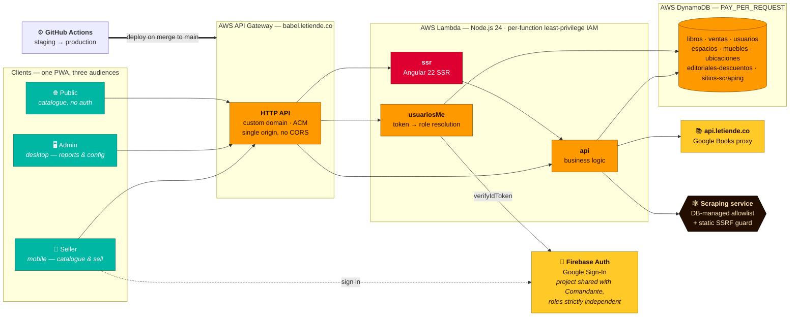

<div align="center">

# Babel

**A production inventory and point-of-sale system for a bookstore — architected through AI agent orchestration, instrumented task by task, and delivered on a 20/80 human-to-agent effort split.**

[](https://babel.letiende.co)
[](https://angular.dev)
[](https://aws.amazon.com)
[](https://serverless.com)
[](#instrumented-delivery)
[](#the-mobile-channel)
[](./README.es.md)

</div>

---

## Executive Summary

> **A production system shipped in 19 calendar days on 43 hours of measured work — of which 20.8% was human.**

Babel is the cataloguing, shelving and sales system for the bookstore at **Le Tiende**, a cultural venue in Bogotá, Colombia. It handles ISBN barcode scanning with automatic metadata enrichment, physical shelf location down to a three-level hierarchy, in-store sales, a public SSR catalogue, and an administrative back office with XLSX financial reporting.

| | |
| :-- | :-- |
| **Time-to-market** | **19 calendar days** — first commit `2026-07-16` → production `2026-08-03` |
| **Measured effort** | **43 h 11 m** across 149 individually tracked tasks, 16 active days |
| **Human / agent split** | **20.8% human · 79.2% agent** — [the Pareto ratio, measured, not estimated](#instrumented-delivery) |
| **Orchestration surface** | **37.1% directed from a phone** — dispatch, review and merge, in motion |
| **Method** | AI-Augmented SDLC — agent orchestration as the primary production method |
| **Delivery cadence** | 269 commits · 84 merged pull requests · ~26 K LOC application · ~3 K LOC IaC |
| **Human-in-the-loop** | 100% of merges to `main` reviewed and approved by a human |
| **Monthly OPEX** | Under **$1 USD/month** in variable cost — after correcting a real $94 billing incident |

The claim is not that an AI wrote the code. The claim is that **a solutions architect running agent orchestration compressed the entire lifecycle** — requirements, architecture, specification, implementation, security review, deployment and incident response — into a fraction of conventional delivery time, and **instrumented every task well enough to prove where the time actually went**.

---

## The Problem

Le Tiende's bookstore had an inventory of **over 3,000 physical books** and no system. No catalogue, no location map, no sales record, no idea what a given title cost, what it sold for, or which shelf it was on. A customer asking "do you have this?" triggered a manual search of the shelves.

Any solution had to survive the founding use case: **one person cataloguing 3,000 books by hand**. That makes the cataloguing flow the critical performance path of the entire system — every extra tap multiplies by three thousand.

## The Solution

A responsive PWA, mobile-first for the shop floor and desktop for administration.

### Cataloguing — the critical path
Scan the ISBN barcode with the phone camera. The system resolves metadata (title, author, cover, publisher) against an internal Google Books proxy, and falls back to scraping an administrator-managed site list to recover the retail price. Everything arrives **pre-filled and editable** — automatic data is a suggestion, never a commitment.

### Physical location
Three-level hierarchy — **space → fixture → location** — so "where is this book" has a literal answer. Fixtures carry printed QR codes generated by a companion tool in [`tools/qr-muebles/`](./tools/qr-muebles).

### Sales
Register a sale from the book's own record in a few taps, with publisher discount applied automatically and per-sale discount support.

### Public catalogue
Server-side rendered, no authentication required, indexable, with per-book detail pages and location filtering.

### Administration
Users, physical layout, publisher discounts, scraping site list, and XLSX exports for sales and inventory reporting.

---

## Architecture



**The load-bearing decisions:**

1. **Authorization never leaves the server.** Angular route guards are UX only. Every protected request verifies the Firebase ID token and resolves the role by querying `babel-usuarios` with the email *from the token*. A role sent in a request payload is ignored by construction. This matters more than usual here: the Firebase project is **shared with [Comandante](https://github.com/ocastelblanco/comandante-letiende)**, so having an account — or an admin role — in the sibling app grants exactly nothing in Babel.

2. **SSRF is guarded statically, not by the allowlist.** The scraping site list is administrator-editable data, so it cannot be the security boundary. Every outbound URL passes through a fixed guard (`esUrlSegura`, in [`server/api/services/scraping.ts`](./server/api/services/scraping.ts)) that requires HTTPS and resolves the hostname to a public IP — rejecting private, loopback and link-local ranges including the `169.254.169.254` metadata endpoint — and re-validates on every redirect via `redirect: 'manual'`.

3. **One origin, two Lambdas.** SSR and API share the domain behind a single HTTP API, which eliminates CORS entirely and keeps the security surface to one edge.

4. **Least privilege per function.** Each Lambda gets its own IAM role scoped to the tables it actually touches — not a shared service role.

---

## Instrumented Delivery

This is the part that distinguishes this project from a fast build.

**Every task in this project — human or agent, planning or execution — is one row in [`tracking-detail.csv`](./tracking-detail.csv).** Not a summary written afterwards: a row appended at the moment the task closed, with a start timestamp captured before the work began.

The instrumentation is not a habit, it is **a rule encoded in the repository**. [`CLAUDE.md` §8](./CLAUDE.md) obliges every agent session to capture `TZ=America/Bogota date` on start, capture it again on finish, and append the row. The measurement system maintains itself because it is part of the agent's operating instructions, not part of anyone's discipline.

Ten columns per row: `stage · start · finish · time · role · model · milestone · tool · device · effort`.

**149 rows. 43 h 11 m. 16 active days**, measured at the production launch cutoff of `2026-08-03`. What follows is that file, aggregated — nothing here is an estimate. The file keeps growing; the aggregates below are a snapshot of that date.

### The Pareto ratio, measured

| Effort | Human | Agent | Total | Share |
| :--- | ---: | ---: | ---: | ---: |
| **high** | 7:47:00 | 31:14:00 | **39:01:00** | 90.4% |
| **medium** | 0:46:00 | 1:47:30 | **2:33:30** | 5.9% |
| **low** | 0:25:30 | 1:11:00 | **1:36:30** | 3.7% |
| **TOTAL** | **8:58:30** | **34:12:30** | **43:11:00** | 100% |
| **Share** | **20.8%** | **79.2%** | | |

**20.8 / 79.2.** The split fell within one percentage point of the Pareto ratio without anyone targeting it — which is the interesting part, because the 20% is not distributed evenly. It concentrates upstream:

| Where the human 8h58m went | Time | Share of human effort |
| :--- | ---: | ---: |
| Specification & requirements | 4:10:00 | **46.4%** |
| Frontend review & visual adjustment | 2:51:30 | 31.8% |
| Backend review | 1:07:00 | 12.4% |
| Cloud infrastructure | 0:33:00 | 6.1% |
| Auth, workspace, scaffold | 0:17:00 | 3.2% |

Nearly half of all human time went into **defining the problem** — and only 3.2% into scaffolding, wiring and setup, which is exactly the work that should be delegated. The architect's leverage is not in typing less code; it is in the 20% of decisions that determine the other 80% of the output.

### Effort and delivery channel

| Effort | CLI | Mobile | Web | Desktop | Total |
| :--- | ---: | ---: | ---: | ---: | ---: |
| **high** | 24:35:00 | 14:19:00 | 0:07:00 | 0:00:00 | **39:01:00** |
| **medium** | 1:34:30 | 0:52:00 | 0:07:00 | 0:00:00 | **2:33:30** |
| **low** | 0:31:30 | 0:51:00 | 0:11:00 | 0:03:00 | **1:36:30** |
| **TOTAL** | **26:41:00** | **16:02:00** | **0:25:00** | **0:03:00** | **43:11:00** |
| **Share** | **61.8%** | **37.1%** | **1.0%** | **0.1%** | |

### Effort by lifecycle stage

| Stage | Total | Share | Agent | Human | Tasks |
| :--- | ---: | ---: | ---: | ---: | ---: |
| Frontend | 11:41:30 | 27.1% | 8:50:00 | 2:51:30 | 49 |
| Specification | 10:28:00 | 24.2% | 6:18:00 | 4:10:00 | 20 |
| Backend | 10:06:00 | 23.4% | 8:59:00 | 1:07:00 | 33 |
| Cloud infrastructure | 8:09:00 | 18.9% | 7:36:00 | 0:33:00 | 24 |
| Workspace setup | 1:40:30 | 3.9% | 1:33:30 | 0:07:00 | 17 |
| Scaffold | 0:40:00 | 1.5% | 0:39:00 | 0:01:00 | 2 |
| Auth integration | 0:26:00 | 1.0% | 0:17:00 | 0:09:00 | 4 |

**Specification is the second most expensive stage in the whole project** — more than cloud infrastructure, nearly as much as the entire backend. In a conventionally-run project that ratio would look like waste. Here it is the cause of the other numbers: the specification is what makes an agent's output reviewable in minutes rather than re-derivable from scratch.

### Model routing as a cost decision

| Model | Time | Share of agent effort |
| :--- | ---: | ---: |
| Sonnet 5 | 32:36:30 | 95.3% |
| Fable 5 | 0:32:00 | 1.6% |
| Opus 4.8 | 0:30:00 | 1.5% |
| Opus 5 | 0:29:00 | 1.4% |
| Kimi 3 | 0:05:00 | 0.2% |

95% of agent work ran on the mid-tier model. The frontier models were reserved for the two things that actually required them — architectural verification and root-causing a real race condition. **Routing is an engineering decision with a line item**, and tracking it per task is what makes that decision reviewable instead of a matter of taste.

### The mobile channel

**37.1% of total project time was directed from an Android phone** — 14 h 19 m of it on high-effort work, not trivia.

This is not a novelty; it is what the architecture permits. When CI/CD owns building, deploying and publishing a verifiable staging URL, the human's remaining job is **dispatch, judgment and approval** — three things that fit on a phone screen. Three preconditions make the loop work, each an architectural decision taken *before* the first task:

1. **A pipeline that produces a verifiable artifact, not a green check.** Every merge deploys to `staging`; verification is opening a URL and using the real feature.
2. **A backlog that holds state so the operator doesn't have to.** The JIT engine in [`TODO.md`](./docs/TODO.md) is capped at two atomic tasks, so *"start the next task"* is an unambiguous instruction with no context to reconstruct.
3. **Constraints in the repository, not in the prompt.** [`CLAUDE.md`](./CLAUDE.md) carries the security rules, code conventions and git policy. The agent arrives pre-constrained, so three lines typed with a thumb produce the same discipline as a full briefing.

> **Reproduce these numbers.** [`tracking-detail.csv`](./tracking-detail.csv) is committed in full. Every aggregate on this page comes from it, and every row is auditable against the git history.

---

## AI-Augmented SDLC

Agent orchestration was the **primary production method**, applied across the entire lifecycle — not an autocomplete assistant bolted onto a conventional process.

| Lifecycle phase | How it was executed |
| :--- | :--- |
| **Requirements** | Structured interview against the business operator's real constraints, before any architecture |
| **Architecture** | Iterative design validated against hard cost and security limits, recorded as ADRs in [`tech-specs.md`](./docs/tech-specs.md) |
| **Specification** | [`PRD.md`](./docs/PRD.md) and [`tech-specs.md`](./docs/tech-specs.md) maintained as living artifacts — 24.2% of total project effort |
| **Planning** | JIT backlog with a hard WIP limit of 2 atomic tasks — no stale plan, no obsolete estimate |
| **Implementation** | Delegated to executor agents, one branch and one pull request per task |
| **Verification** | Independent reviewer agents — **the agent that writes code never approves it** |
| **Security** | OWASP Top 10 mapped to this system's actual attack surface and encoded as permanent constraints in [`CLAUDE.md` §5](./CLAUDE.md) |
| **Git flow** | Enforced by policy: agents are structurally forbidden from pushing to `main` or merging any PR |
| **Measurement** | Per-task instrumentation obligatory for every agent session ([`CLAUDE.md` §8](./CLAUDE.md)) |

**The guardrails that made the speed safe.** Velocity without discipline produces unreviewable code. Four constraints kept it honest:

1. **No agent merges its own work.** All 84 pull requests were reviewed and merged by a human.
2. **Constraints live in the repository.** [`CLAUDE.md`](./CLAUDE.md) encodes security rules, code conventions, git policy and the tracking obligation as versioned instructions, so context survives across sessions, agents and model changes.
3. **A WIP limit of 2.** [`TODO.md`](./docs/TODO.md) never holds more than two atomic tasks.
4. **One task, one branch, one PR, one staging verification.** Deployment to shared staging is serialized — a second PR never opens before the previous one finishes deploying.

**The compounding artifact.** [`MEMORY.md`](./docs/MEMORY.md) and [`CLAUDE.md` §7](./CLAUDE.md) accumulate the non-obvious stack behaviours discovered during development: `getUserMedia` failing silently on iOS Safari unless triggered by a direct tap; Lambda function descriptions capped at 256 characters breaking a deploy; Google avatar URLs returning HTTP 429 without `referrerpolicy="no-referrer"`. Each debugging session is captured once and never re-litigated. **That file is the real deliverable of the method — the codebase is its output.**

---

## Cost: The $94 Incident

The project declared a $0 infrastructure target. In July 2026 it billed **US$94.44**. That number is documented in this repository rather than quietly fixed, because how it happened is more instructive than the fix.

**The cause was not a technical failure. It was an unverified price assumption written down as if it were a fact** — in the specification *and* in a code comment:

> `# Provisioned capacity 25/25 on all tables (AWS always-free tier, $0 cost target, never on-demand).`

AWS grants 25 RCU + 25 WCU free **per account, not per table**. Babel had 8 tables × 2 stages + 2 GSIs = **18 units of 25/25 = 450 RCU + 450 WCU**, eighteen times the free allowance, on a run rate of **~US$256/month** — to store 43 records. A comment written to *save* money created the largest line item in the account.

| | Before | After |
| :--- | ---: | ---: |
| DynamoDB billing mode | `PROVISIONED` 25/25 × 18 | `PAY_PER_REQUEST` |
| Projected DynamoDB cost | ~US$256/month | **< US$0.10/month** |
| Lambda cost (full month, real traffic) | US$0.00028 | US$0.00028 |

The fix was one command. **The lesson was a process change**, now a mandatory pre-flight document for every Le Tiende project — [`docs/advertencia-urgente-costos-aws.md`](./docs/advertencia-urgente-costos-aws.md):

- **Never write a price, a "this is free" or a "this is never charged" that you have not verified that same day** — and if you haven't, write `UNVERIFIED` next to it.
- **Configure the budget alarm before deploying the first resource, calibrated *above* the account's real fixed-cost floor.** A US$4 monthly budget in an account with ~7 Route 53 hosted zones (US$3.58/month fixed) saturates at 89% before the project exists — and then a US$90 overrun is indistinguishable from noise. This incident ran for 11 days undetected for exactly that reason.
- **Any capacity billed by time rather than by use is a permanent liability.** Hunt for it explicitly before every deploy.
- **Before deleting an "unused" resource, check what points at it from outside.** During the cleanup of this very incident, a CloudFormation stack that `list-stack-resources` reported as stateless took an unrelated production API down for ~15 minutes via a custom domain mapping it didn't list.

There is a specific, aggravated risk for AI agents here, and it is written into the project's permanent instructions: **an agent's knowledge of cloud pricing is stale by construction.** The confidence with which a model asserts "25 RCU are free" bears no relationship to whether that is true today, in this account, under this free-tier model.

### Zero-cost architecture

| Service | Mode | Monthly cost |
| :--- | :--- | ---: |
| AWS Lambda (`ssr`, `api`, `usuariosMe`) | On-demand, 256 MB | ~$0.00 |
| AWS DynamoDB (8 tables × 2 stages) | `PAY_PER_REQUEST` | < $0.10 |
| AWS API Gateway (HTTP API) | On-demand | ~$0.00 |
| AWS S3 (deployment artifacts) | Capped at 5 retained versions | ~$0.01 |
| AWS Certificate Manager | — | $0.00 |
| GitHub Actions | Free tier | $0.00 |
| AWS Route 53 hosted zone | Fixed per zone | $0.50 |

**The free quota is the spend ceiling.** With no provisioned capacity anywhere in the stack, there is nothing billing while idle: a cost incident degrades into a service incident, never into a surprise invoice. The only fixed cost left is the shared DNS zone.

---

## Tech Stack

| Layer | Technology |
| :--- | :--- |
| Frontend framework | Angular 22 — standalone components, Signals, SSR via `@angular/ssr` |
| Styling | Tailwind CSS 4 with semantic tokens (Le Tiende brand palette) |
| Barcode scanning | `@zxing/browser` over `getUserMedia` |
| Backend runtime | Node.js 24 on AWS Lambda |
| API | AWS API Gateway HTTP API, custom domain, single origin |
| Database | AWS DynamoDB, `PAY_PER_REQUEST` |
| Authentication | Firebase Authentication — Google Sign-In (project shared with Comandante, roles independent) |
| Book metadata | `api.letiende.co` — internal Google Books proxy, with scraping fallback |
| HTML parsing | `cheerio` — text extraction only, never re-rendered |
| Reporting | `xlsx` |
| IaC | Serverless Framework 4 — per-function least-privilege IAM roles |
| CI/CD | GitHub Actions — automatic staging deploy, gated production deploy |
| Testing | Vitest (API) · Angular test harness (frontend) |
| Language | TypeScript `strict` — `any` is banned |

---

## Running Locally

```bash
git clone https://github.com/ocastelblanco/babel-letiende.git
cd babel-letiende
npm ci
npm start                                    # dev server at localhost:4200
```

```bash
npm test                                     # frontend unit tests
npm run test:api                             # API tests (Vitest)
npm run build:infra                          # production SSR + API build
npm run deploy:staging                       # deploy to staging
```

**Requirements:** Node.js 24, an AWS account, and access to the shared Firebase project. Firebase client configuration lives in `src/environments/` and is not sensitive. Service account credentials and AWS keys are injected as GitHub Actions secrets and are never committed.

---

## Security

Security rules are mapped to this system's actual attack surface and encoded as permanent, versioned constraints in [`CLAUDE.md` §5](./CLAUDE.md) — including a table of absolute code prohibitions that agents are instructed to treat as non-negotiable.

| OWASP | Risk in this system | Control |
| :--- | :--- | :--- |
| **A01** Broken access control | A seller calling an admin endpoint; a role inherited from the sibling app | Authorization resolved server-side against `babel-usuarios` using the email from the verified token. Client-supplied roles ignored. |
| **A02** Cryptographic failures | Firebase service account or AWS credentials leaking into the repo | All secrets injected via GitHub Actions. Babel uses its own service account — never Comandante's — so either can be rotated independently. |
| **A03** Injection / XSS | Scraped titles and authors rendered directly | Standard Angular interpolation only. Scraping extracts plain text via specific `cheerio` selectors; third-party HTML is never forwarded or rendered. `innerHTML` and unsanitized `bypassSecurityTrustHtml` are banned. |
| **A05** Security misconfiguration | Over-broad Lambda IAM; stack traces in production | One least-privilege IAM role per function, scoped to the tables it uses. Production errors return a generic message and an HTTP code, never internals. |
| **A07** Authentication failures | Stale sessions; revoked tokens still accepted | `verifyIdToken` on every protected request (validates expiry and revocation). Sign-out clears all reactive state before redirecting. |
| **A08** Data integrity | An automatically scraped price accepted as fact | All automatic data is pre-loaded as an *editable suggestion*. The backend range-validates a suggested price before offering it. `npm ci` with a committed lockfile in CI. |
| **A10** SSRF | Outbound requests built from external data | Static `esUrlSegura` guard: HTTPS required, hostname must resolve to a public IP, private/loopback/link-local and `169.254.169.254` rejected, re-validated on every redirect. The administrator-editable allowlist is a policy layer, never the security boundary. |

---

## Contributing

This repository enforces a strict git flow ([`CLAUDE.md` §6](./CLAUDE.md)): every change reaches `main` **only** through a human-reviewed pull request. AI agents are structurally forbidden from committing to `main`, force-pushing, or merging any PR — including their own.

1. Branch from `main` using `feature/*`, `fix/*`, `docs/*`, `hotfix/*` or `refactor/*`
2. Make the change and confirm `npm run build` passes
3. Stage specific files — never `git add .`
4. Open a pull request against `main` describing the change and how to verify it

Code, commits, comments and database identifiers are written in **Spanish**; the interface is Spanish (Colombia).

---

## Project Documentation

| Document | Contents |
| :--- | :--- |
| [`PRD.md`](./docs/PRD.md) | Product vision, user profiles, use cases and roadmap |
| [`tech-specs.md`](./docs/tech-specs.md) | Architecture, data model, endpoints and ADRs |
| [`CLAUDE.md`](./CLAUDE.md) | Permanent agent instructions: code, security, git flow, stack gotchas and the tracking obligation |
| [`DESIGN.md`](./docs/DESIGN.md) | Design system, brand tokens and UI conventions |
| [`TODO.md`](./docs/TODO.md) | JIT backlog — at most two atomic tasks at any time |
| [`MEMORY.md`](./docs/MEMORY.md) | Accumulated project state and completed-task history |
| [`advertencia-urgente-costos-aws.md`](./docs/advertencia-urgente-costos-aws.md) | Mandatory pre-flight cost document for any AWS infrastructure work |
| [`tracking-detail.csv`](./tracking-detail.csv) | Per-task time instrumentation — 149 rows, the source of every metric on this page |

---

## License

[MIT](./LICENSE).

---

<div align="center">
<sub>Built for <b>Le Tiende</b> — bookstore, café bar and cultural venue · Bogotá, Colombia<br/>
Sibling system: <a href="https://github.com/ocastelblanco/comandante-letiende">Comandante</a> — point of sale · Contact: <a href="https://github.com/ocastelblanco">@ocastelblanco</a></sub>
</div>
