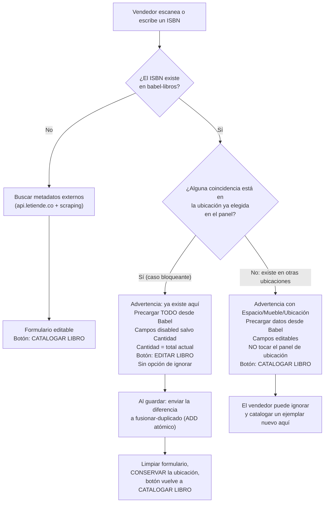

# Plan — Duplicados en catalogación, apilamiento público y reporte de repetidos

Documento de diseño para el lote de 3 funcionalidades traído por el usuario el **2026-08-29**. Sin código todavía: este documento fija las decisiones de producto y el desglose de tareas para que la implementación arranque en la siguiente sesión.

**Origen:** el usuario detectó que un mismo libro se catalogó **dos veces en la misma ubicación**, a pesar de la advertencia de duplicados que ya existe en la interfaz (`TODO.md` Tarea 2.3, PR #79). El lote ataca el problema en tres frentes: prevenirlo al catalogar (Tarea 1), detectar los casos ya existentes (Tarea 2) y dejar de mostrarlos como libros distintos al público (Tarea 4).

---

## 1. Qué existe hoy (punto de partida verificado)

Antes de diseñar nada se revisó el código real. Buena parte de la infraestructura ya está construida:

| Pieza existente | Dónde | Sirve para |
|---|---|---|
| GSI `isbn-index` sobre `babel-libros` | `serverless.yml` | Buscar por ISBN exacto sin `Scan` — instantáneo |
| `GET /api/libros/por-isbn/:isbn` | `libros.ts`, `handlerBuscarPorIsbn` | Ya devuelve `LibroConUbicacion[]` (con Espacio/Mueble/Ubicación resueltos) |
| `POST /api/libros/:bookId/fusionar-duplicado` | `libros.ts`, `handlerFusionarDuplicado` | Suma ejemplares de forma **atómica** (`ADD` de DynamoDB, sin leer antes de escribir) |
| Detección de duplicados en la UI | `catalogar-libro.component.ts` | 1 coincidencia → autoselección; varias → lista para elegir |
| `escanearProyeccion` | `dynamodb.ts` | `Scan` paginado trayendo solo ciertos atributos |
| Patrón de reporte XLSX | `libros.ts`, `handlerExportarInventario` | 3 `escanearTodo` en paralelo + `Map` en memoria para resolver ubicaciones |
| Pantalla de Reportes con 2 botones de exportación | `reportes-ventas.component.html` | Agregar un tercero es un patrón ya establecido |

**Qué falla hoy y explica el incidente reportado.** El flujo actual, ante 1 coincidencia por ISBN, **sobrescribe silenciosamente el panel "Ubicación del libro"** con la ubicación del duplicado (`seleccionarDuplicado`). Es decir: el vendedor elige la ubicación B, escanea un ISBN que ya existe en la ubicación A, y el formulario salta a A sin avisar. Además, la advertencia es un texto pequeño con un enlace "Ignorar y catalogar como nuevo" fácil de pulsar, y **no distingue** si el duplicado está en la misma ubicación o en otra — que es justo la diferencia que importa.

---

## 2. Decisiones de producto confirmadas con el usuario (2026-08-29)

| # | Decisión | Elegida |
|---|---|---|
| D1 | Semántica del campo **Cantidad** cuando el libro ya existe en la misma ubicación | El campo se **precarga con el total actual**; al guardar, el frontend calcula la **diferencia** y la envía a `fusionar-duplicado`. Conserva la atomicidad y coincide con "aumente la Cantidad". |
| D2 | Criterio para **apilar** ejemplares en el catálogo público | **Solo por ISBN.** Los libros sin ISBN nunca se apilan. Cero riesgo de fusionar dos libros distintos en la cara pública. |
| D3 | Cómo consultar Babel primero al **buscar por título/autor** | **Índice ligero cacheado en el cliente**: endpoint nuevo con campos mínimos, cargado una vez por sesión, filtrado en memoria. |
| D4 | **PVP** en la ficha apilada cuando los ejemplares difieren | **PVP por panel de ubicación**; en la cabecera, el valor único si todos coinciden, o un **rango** si no. |

### Supuestos adicionales — CONFIRMADOS por el usuario (2026-08-29)

- **S1 — Precedencia.** Si el mismo ISBN existe **a la vez** en la ubicación elegida y en otras, gana el caso "misma ubicación" (es el que bloquea). Las demás ubicaciones se listan como información dentro de esa misma advertencia.
- **S2 — Sin escape en el caso bloqueante.** En "misma ubicación" **desaparece** el enlace "Ignorar y catalogar como nuevo": permitirlo es exactamente lo que se quiere evitar. En "otra ubicación" **sí** se conserva (tu texto dice "ignore esta advertencia").
- **S3 — Reducir cantidad.** El flujo "Editar libro" solo **suma** ejemplares (el endpoint atómico exige un entero > 0). Si el vendedor pone un número **menor** al actual, se muestra un mensaje que lo remite a la pestaña **Editar**, sin enviar nada.
- **S4 — `libroId` del reporte** es el `bookId` del modelo `Libro` (la clave primaria). Se rotula "libroId" en el XLSX tal como lo pediste.
- **S5 — Columnas extra del reporte.** Se agregan **`Grupo`** (un número por conjunto de repetidos) y **`Motivo`** (`ISBN` / `Título` / `ISBN y título`), y las filas se ordenan por grupo. Sin eso el listado es una lista plana muy difícil de leer para el librero.
- **S6 — Ubicaciones agotadas en la ficha apilada.** Se muestran paneles solo para ejemplares con `cantidadDisponible > 0`. Si **todos** están agotados, la ficha se sigue mostrando (comportamiento actual: un enlace directo debe funcionar aunque el libro esté agotado) con la nota de agotado y sin ningún botón VENDER.
- **S7 — La URL no cambia.** La ficha sigue siendo `/libro/:bookId`. El backend resuelve el grupo a partir del ISBN de **ese** libro, así que todos los enlaces y el SEO ya existentes se conservan.

---

## 3. Flujo de decisión al escanear/escribir un ISBN (Tarea 1)

**Cambio clave de rendimiento:** si el ISBN ya está en Babel, **no se llama a la búsqueda de metadatos externos en absoluto**. Hoy siempre se llaman los dos, en serie (`dispararBusquedaPorIsbn`: primero metadatos, después duplicados, para que la ficha catalogada pise a la externa). Al invertirlo, el caso "libro ya conocido" pasa de *una consulta externa de varios segundos* a *una `Query` sobre un GSI*. Esto es lo que materializa tu "la primera fuente debe ser la propia base de datos de Babel" en la ruta crítica.

---

## 4. Tarea 1 — Duplicados en catalogación *(COMPLETA, 2026-08-29)*

**Alcance:** solo `CatalogarLibroComponent` y su plantilla. **No requiere backend nuevo** — `GET /api/libros/por-isbn/:isbn` ya devuelve todo lo necesario (incluida la ubicación resuelta) y `POST /api/libros/:bookId/fusionar-duplicado` ya suma de forma atómica.

- [x] Invertir el orden en `dispararBusquedaPorIsbn`: consultar Babel primero y **saltarse** la búsqueda de metadatos externos si hay coincidencia.
- [x] Clasificar las coincidencias contra `panelUbicacionId()`: `mismaUbicacion` vs. `otrasUbicaciones` (regla **S1**) — nuevo `computed` `duplicadoEnMismaUbicacion`, reactivo (se reclasifica solo si el vendedor cambia el panel después de detectar el duplicado).
- [x] **Caso misma ubicación:** advertencia con el texto exacto pedido; precargar todos los campos; `disable()` en todos salvo `cantidadTotal`; precargar `cantidadTotal` con el `cantidadTotal` existente; botón "Editar libro"; sin enlace de ignorar (**S2**). Implementado con un `effect()` en el constructor que reacciona a `duplicadoEnMismaUbicacion()`.
- [x] Al guardar en ese caso: `delta = cantidadNueva - cantidadOriginal`; si `delta <= 0`, mensaje que remite a **Editar** (**S3**); si `delta > 0`, `POST .../fusionar-duplicado` con `ejemplaresNuevos: delta`.
- [x] Tras guardar: `reset()` del formulario **conservando** `panelEspacioId`/`panelMuebleId`/`panelUbicacionId`, re-`enable()` de los campos (vía el mismo `effect`, al quedar `libroDuplicadoSeleccionado` en `null`) y botón de vuelta a "Catalogar libro".
- [x] **Caso otra ubicación:** advertencia con el texto Markdown pedido (título en negrita + Espacio/Mueble/Ubicación); precargar datos; **dejar de sobrescribir el panel de ubicación** (corrige el comportamiento actual — causa real del incidente reportado); conservar el enlace de ignorar. Al guardar, crea un `bookId` nuevo e independiente (`POST /api/libros`, nunca `fusionar-duplicado`) en la ubicación que el vendedor ya había elegido.
- [x] Cuidado con `disabled` en Angular Reactive Forms: un control deshabilitado **queda fuera** de `formulario.value`. Se usa `getRawValue()` en `guardar()`.
- [x] Tests: ambos casos, el cálculo del delta, el delta no positivo, la reclasificación al mover el panel, y que el panel de ubicación ya no se sobrescribe en el caso "otra ubicación". 9 tests nuevos/reescritos (369 tests frontend en total). `npm run build` limpio; smoke test `ng serve` + `curl /catalogar` (200, sin crash) — verificación visual interactiva con login real queda pendiente del usuario en `staging`.

## 5. Tarea 2 — Reporte de libros repetidos *(COMPLETA, 2026-08-29)*

**Por qué en paralelo con la Tarea 1:** la Tarea 1 evita duplicados **nuevos**; este reporte permite encontrar y limpiar los que **ya están** en producción. Es la mitad correctiva del problema y es independiente.

- [x] Backend: `GET /api/libros/exportar-repetidos`, función Lambda propia (`handlerExportarRepetidos`, ADR-008), rol `administrador` exclusivamente (mismo criterio que `exportar`/`exportar-inventario`: dato de negocio). Ruta estática, sin conflicto con `/api/libros/{bookId}`.
- [x] Reutiliza el patrón de `handlerExportarInventario`: 3 `escanearTodo` en paralelo + `Map` en memoria para resolver Espacio/Mueble/Ubicación.
- [x] `normalizarParaComparacion(texto)`: minúsculas, sin tildes (NFD + quitar diacríticos), sin caracteres especiales, espacios internos colapsados, `trim`. Función pura y exportada, con tests propios.
- [x] Agrupa con **componentes conexos (union-find)**: dos libros quedan unidos si comparten ISBN **o** título normalizado; la relación encadena. Implementado con `Map` por ISBN/título en vez de comparar cada par (`O(n²)` inviable con 3.000+ libros).
- [x] Emite solo los grupos de **2 o más** libros. Columnas: `Grupo`, `Motivo`, `libroId`, `ISBN`, `Título`, `Autor`, `Editorial`, `PVP`, `Espacio`, `Mueble`, `Ubicación` (**S4**, **S5**). `Motivo` (`ISBN`/`Título`/`ISBN y título`) se calcula por grupo, buscando un ISBN o título repetido DENTRO del propio grupo — funciona también en grupos de 3+ libros formados por encadenamiento.
- [x] Frontend: tercer bloque en `/admin/reportes`, calcado del bloque "Reporte de inventario" ya existente (`LibrosService.exportarRepetidos()`, mismo patrón de descarga de blob).
- [x] Tests: normalización (tildes, caracteres especiales, espacios), encadenamiento transitivo (grupo de 3 formado por ISBN + título), grupo de un solo libro excluido, coincidencia solo por ISBN, solo por título. 7 tests backend + 7 frontend nuevos (361 backend / 376 frontend en total). `npm run build`/`build:api`/`serverless print --stage dev`/`serverless package --stage dev` verificados sin errores — el zip empaquetado incluye `libros.js`/`verificar-token.js`/`dynamodb.js`. Smoke test `ng serve` + `curl /admin/reportes` (200, sin crash) — verificación visual interactiva con login real queda pendiente del usuario en `staging`.

## 6. Tarea 3 — Babel como primera fuente al buscar por título/autor *(COMPLETA, 2026-08-29)*

Depende de la decisión **D3**. Fue la única parte del lote que necesitó infraestructura nueva.

- [x] Backend: `GET /api/libros/indice` (`handlerIndice`, función Lambda propia, rol `vendedor`/`administrador`). Usa `escanearProyeccion` con los campos mínimos: `bookId`, `isbn`, `titulo`, `autor`, `ubicacionId`, `pvp`, `portadaUrl`, `cantidadDisponible`.
- [x] **Medido el tamaño real de la respuesta** contra el catálogo de `production` (`aws dynamodb scan` con la misma `ProjectionExpression`, 2026-08-29): 1.534 libros hoy, ~360 B/libro sin comprimir (~100 B/libro con gzip). A 3.000 libros (volumen fundacional) el índice pesa ~1 MB sin comprimir, **~300 KB con gzip** (que API Gateway HTTP API aplica automáticamente) — aceptable para una sola carga por sesión. Decisión: **mantener `portadaUrl`** pese a ser el campo más pesado, para que el vendedor siga viendo la miniatura del candidato (igual que ya ve con los candidatos externos) — es el primer campo a sacrificar si el catálogo crece mucho más allá de ese volumen.
- [x] Frontend: `LibrosService.cargarIndice()` con caché en un Signal a nivel de servicio (`providedIn: 'root'`), cargado una vez por sesión al entrar a Catalogar (`indiceSolicitado`, evita pedirlo dos veces incluso si la primera falló); nunca lanza.
- [x] `buscarCandidatos()` consulta **primero** el índice en memoria (`filtrarIndice`, insensible a mayúsculas/tildes — si el vendedor escribió título Y autor, exige que AMBOS coincidan); solo si no hay coincidencias recurre a `MetadatosService.buscarCandidatos` (externo). Los resultados de Babel se marcan visualmente con una etiqueta "Ya en el catálogo".
- [x] Al elegir un resultado de Babel, se resuelve la ficha completa por `bookId` (`LibrosService.obtenerDetalle`, el índice ligero no trae `editorial`/descuento) y entra por el MISMO camino de duplicados de la Tarea 1 (`seleccionarDuplicado`, misma ubicación / otra ubicación) — reutilizado tal cual, sin duplicar lógica.
- [x] Ajuste retroactivo a `seleccionarDuplicado` (Tarea 1): ahora también precarga el campo `isbn` — necesario para este flujo (un candidato de Babel elegido por título/autor puede llegar sin que el campo isbn se haya tocado todavía); sin efecto en el flujo por ISBN de la Tarea 1, donde el campo ya tenía ese mismo valor.
- [x] 5 tests backend (`handlerIndice`) + 4 (`LibrosService.cargarIndice`, incluida la caché de sesión) + 6 (`CatalogarLibroComponent`, búsqueda en índice/fallback externo/AND de título+autor/selección misma-otra ubicación) nuevos (366 backend / 386 frontend en total). `npm run build`/`build:api`/`serverless print --stage dev`/`serverless package --stage dev` verificados sin errores (zip con `libros.js`/`verificar-token.js`/`dynamodb.js`). Smoke test `ng serve` + `curl /catalogar` (200, sin crash) — verificación visual interactiva con login real queda pendiente del usuario en `staging`.

## 7. Tarea 4 — Apilamiento en el catálogo público *(slot activo)*

- [ ] Backend: extender `GET /api/libros/:bookId` de forma **aditiva** — conserva todos los campos actuales de `LibroConUbicacion` y agrega `ejemplares: EjemplarConUbicacion[]`. Con ISBN, se resuelven con una `Query` al GSI `isbn-index` (sin `Scan`); sin ISBN, `ejemplares` trae solo el propio libro (**D2**). Único consumidor hoy: `LibroDetalleComponent`, así que el riesgo de romper algo es mínimo.
- [ ] Frontend, listado (`CatalogoPublicoComponent`): agrupar por ISBN dentro del `computed` que ya filtra y ordena — la lista completa ya está en memoria, no hace falta tocar `GET /api/libros`. Una tarjeta por grupo, sumando `cantidadDisponible`.
- [ ] Frontend, ficha (`LibroDetalleComponent`): un panel "Ubicación en la librería" por ejemplar disponible, cada uno con su PVP y su botón VENDER (**D4**, **S6**). El diálogo de venta actúa sobre el `bookId` **de ese panel**.
- [ ] La cabecera muestra PVP único o rango (**D4**). Revisar que el `<title>`/`<meta>` de SSR sigan correctos (**S7**).
- [ ] Tests: agrupación en el listado, varios paneles en la ficha, VENDER por panel, ejemplar agotado sin botón, libro sin ISBN sin apilar.

---

## 8. Orden y justificación

1. **Tarea 1** (COMPLETA, 2026-08-29) — era el arreglo directo del problema reportado y no necesitó backend nuevo.
2. **Tarea 2** (COMPLETA, 2026-08-29) — independiente, permite limpiar los duplicados que ya existen en producción.
3. **Tarea 3** (COMPLETA, 2026-08-29) — era la única que agregaba infraestructura; el tamaño real del índice se midió contra producción antes de darla por buena (§6).
4. **Tarea 4** (activa, última del lote) — es cosmética/UX y no depende de ninguna de las anteriores.

Las tareas se implementan **de una en una, un PR por tarea** (`MEMORY.md`: el stage `staging` es compartido y dos PRs abiertos a la vez se pisan el stack de CloudFormation).

## 9. Recordatorios de proceso para la implementación

Aprendidos a golpes en este mismo proyecto — revisar antes de dar por cerrada cualquier tarea con backend nuevo:

- Cada función Lambda nueva: `description` de **256 caracteres o menos**, y verificar con `npx serverless print --stage dev` (gotcha reincidente, `MEMORY.md` §7).
- Rol IAM **acción por acción** contra el código real (`obtenerPorClave` → `GetItem`, `escanearTodo`/`escanearProyeccion` → `Scan`); ningún test unitario detecta un desajuste aquí porque todos mockean la capa de DynamoDB.
- `package.patterns` de la función nueva: incluir **todos** los módulos que el archivo importa a nivel superior, no solo los que usa ese handler.
- Un campo que el tipo declara `T | null` puede llegar `undefined` desde DynamoDB si se persiste omitiendo el atributo — normalizar al leer (gotcha del 2026-08-29, `isbn`).
