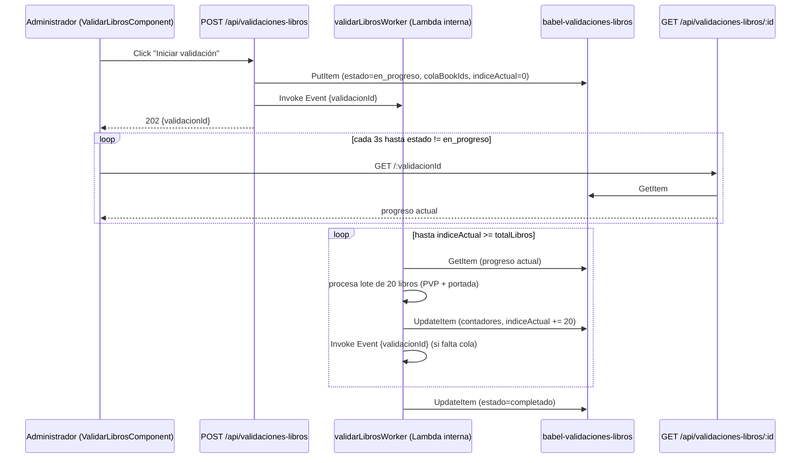

# Plan — Proceso asíncrono "Validar libros" (PVP + portada, por mueble)

Documento de diseño de la Tarea 3 del lote de catalogación traído por el usuario el 2026-08-18 (ver `TODO.md`). Es la pieza más grande de ese lote y la primera vez que Babel necesita un patrón asíncrono: revisar en bloque, contra los sitios de `babel-sitios-scraping`, el PVP y la portada de TODOS los libros ya catalogados, sin bloquear al administrador ni arriesgar un timeout de Lambda (10s por defecto) sobre un inventario de 3.000+ libros.

Las decisiones de producto ya se resolvieron con el usuario en la sesión que trajo el lote (2026-08-18, ver `TODO.md`/`MEMORY.md` de conversación) y no se reabren aquí. Este documento resuelve el **detalle fino de implementación** que quedó pendiente: modelo de datos exacto, contrato de las 3 Lambdas, permisos IAM y forma del polling — nada de esto estaba persistido en ningún archivo antes de este PR.

---

## 1. Decisiones de producto ya resueltas (no se reabren)

1. **Regla de consenso de PVP:** de los PVP que logran scrapearse para un libro (1 a N sitios con `pvp: true`), se toma el **más alto** como referencia. El PVP de Babel se reemplaza únicamente si difiere del vigente.
2. **Chequeo de portada inválida:** es **global**, no por sitio de origen — se compara `libro.portadaUrl` contra la unión de `palabrasClaveInvalidas` de TODOS los sitios con `info: true` (`portadaEsInvalida`, `server/api/services/scraping.ts`, Tarea 2). Babel no rastrea de qué sitio vino la portada de un libro ya catalogado, así que no hay forma de acotar el chequeo a un solo sitio.
3. **Libros sin ISBN:** se saltan únicamente la validación de PVP (no se puede scrapear por ISBN). El chequeo de portada inválida sí les aplica — es una comparación de texto sobre la URL ya guardada, no requiere ISBN.
4. **Arquitectura async:** Lambda auto-invocada por lotes (`InvocationType: 'Event'`) + tabla de progreso en DynamoDB + polling desde el frontend. Sin Step Functions ni SQS — ver ADR-012 (`MEMORY.md` §3) para la justificación completa.

---

## 2. Flujo end to end



---

## 3. Modelo de datos — tabla `babel-validaciones-libros`

Un ítem = una "corrida" de validación completa (no una fila por libro ni por mueble). Igual que el resto de tablas del proyecto: `PAY_PER_REQUEST`, sin GSI.

```typescript
interface ValidacionLibros {
  validacionId: string;              // PK, uuid
  estado: 'en_progreso' | 'completado' | 'error';
  iniciadoPor: string;                // email del administrador (del token verificado, nunca del body)
  iniciadoEn: string;                 // ISO
  actualizadoEn: string;              // ISO, se toca en cada lote — usado para detectar corridas colgadas (§6)

  // Cola de trabajo — se calcula UNA sola vez en POST /api/validaciones-libros
  // agrupando los libros por mueble (join en memoria libro.ubicacionId →
  // Ubicacion.muebleId, mismo patrón que `handlerExportarInventario` en
  // libros.ts) y ordenando por nombre de mueble/ubicación — así lotes
  // consecutivos del worker tienden a caer dentro del mismo mueble, lo que
  // permite mostrarle al administrador un progreso legible ("Validando:
  // Biblioteca 2") sin necesitar releer las 3 tablas de ubicación en cada
  // invocación del worker.
  colaBookIds: string[];
  indiceActual: number;               // cursor: próximo índice sin procesar
  totalLibros: number;

  // Resultados acumulados
  librosRevisados: number;
  pvpActualizados: number;            // libros cuyo pvp cambió por consenso
  portadasCorregidas: number;         // portada inválida → se encontró un reemplazo válido
  portadasPendientes: Array<{ bookId: string; titulo: string; portadaUrl: string }>; // inválida, sin reemplazo — requiere revisión manual
  erroresLibro: Array<{ bookId: string; mensaje: string }>; // fallo puntual inesperado, nunca detiene el resto

  muebleActualNombre: string | null;  // se recalcula cada vez que el índice cruza a un mueble distinto
}
```

**Tamaño del ítem:** `colaBookIds` es la parte que más pesa — 3.000 uuids (~36 caracteres c/u) son ~110 KB, muy por debajo del límite de 400 KB de DynamoDB. Con el catálogo fundacional de "~3.000 libros" (`CLAUDE.md` §1) esto es holgado; si el inventario creciera un orden de magnitud, este diseño necesitaría revisarse (fuera de alcance actual).

**Por qué un solo ítem y no una fila por mueble/libro:** el volumen es pequeño (una corrida completa cabe cómoda en un ítem) y el polling del frontend necesita un solo `GetItem` para conocer el estado global — una tabla de progreso por mueble obligaría a un `Query`/`Scan` adicional solo para agregar el total, sin beneficio real a este tamaño.

---

## 4. Las 3 Lambdas

### 4.1 `POST /api/validaciones-libros` — inicia una corrida

- Rol requerido: `administrador` exclusivamente (mismo criterio que otras operaciones de bulk/config — `handlerEliminar` en `libros.ts`, ADR-008).
- Body: `{}` (sin parámetros — valida el inventario completo; no hay forma de acotar a un solo mueble desde la UI en este alcance, "por mueble" es una estrategia de PROCESAMIENTO interno, no un filtro de usuario).
- Pasos:
  1. `Scan` de `babel-validaciones-libros` filtrando `estado = 'en_progreso'`. Si existe una corrida activa **y** `actualizadoEn` es de hace menos de 10 minutos, responde `409` con `{ validacionId }` de la corrida en curso (evita 2 corridas pisándose los contadores del mismo libro — mismo espíritu que la regla dura de staging compartido, `MEMORY.md`). Si la corrida activa lleva más de 10 minutos sin tocar `actualizadoEn`, se considera abandonada: se marca `estado = 'error'` y se continúa con una corrida nueva (ver §6).
  2. `escanearTodo` en paralelo sobre `babel-libros`, `babel-ubicaciones` y `babel-muebles` (mismo patrón que `handlerExportarInventario`).
  3. Agrupa `bookId` por `muebleId` (vía `libro.ubicacionId → Ubicacion.muebleId`), ordena los muebles alfabéticamente por nombre (mismo criterio de PRD.md §5.6 para desplegables) y concatena los `bookId` de cada grupo en `colaBookIds`. Libros con `ubicacionId` roto (ubicación ya no existe — dato inconsistente, ver `resolverUbicacion`) van al final, agrupados como "sin mueble".
  4. `PutItem` del ítem inicial (`estado: 'en_progreso'`, `indiceActual: 0`, contadores en 0).
  5. Invoca `validarLibrosWorker` con `InvocationType: 'Event'` y payload `{ validacionId }` — no espera la respuesta.
  6. Responde `202` con `{ validacionId }`.
- Nunca hace el trabajo pesado en el propio request — timeout por defecto (10s) es suficiente para 3 Scans + 1 Put + 1 Invoke.

### 4.2 `validarLibrosWorker` — Lambda interna, sin ruta HTTP

No se expone vía API Gateway (sin bloque `events` en `serverless.yml`) — solo se invoca a sí misma y es invocada por `handlerIniciar`. Recibe el evento crudo `{ validacionId: string }`, no un `APIGatewayProxyEvent`.

- **Tamaño de lote fijo: 20 libros por invocación**, independiente del tamaño del mueble que esté cruzando — así una corrida nunca depende del mueble más grande del inventario para acotar la duración de una invocación. Si un mueble tiene más de 20 libros, simplemente abarca 2+ invocaciones seguidas (el progreso "Validando: Biblioteca 2" se mantiene estable mientras tanto).
- Pasos por invocación:
  1. `GetItem` del ítem de progreso. Si `estado !== 'en_progreso'`, termina de inmediato (protección ante una auto-invocación duplicada por un reintento de Lambda, ver §6).
  2. Toma `colaBookIds.slice(indiceActual, indiceActual + 20)`.
  3. Para cada `bookId` del lote, **en paralelo** (`Promise.all`, mismo criterio de paralelismo que `resolverMetadatosCompletos`):
     - `GetItem` del libro actual (nunca confía en un snapshot viejo — otro vendedor pudo editarlo mientras la corrida esperaba su turno en la cola).
     - Si `libro.isbn !== null`: `escanearTodo(babel-sitios-scraping)` (una sola vez por invocación, reutilizado por los 20 libros del lote, no por libro) → sitios con `pvp: true` → `scrapearSitio` en paralelo → de los PVP válidos obtenidos, toma el más alto (`Math.max`) → si difiere del `libro.pvp` actual, recalcula `costo`/`utilidadCatalogo` con la misma fórmula que `handlerEditar` y marca el libro para guardar.
     - Si `libro.portadaUrl !== null` y `portadaEsInvalida(libro.portadaUrl, palabrasClaveInvalidasGlobales)`: intenta un reemplazo. Si el libro tiene ISBN, prueba los sitios con `info: true` en orden de `prioridad` (mismo criterio que `resolverMetadatosCompletos`) hasta encontrar una portada que pase `!portadaEsInvalida`; si la encuentra, la reemplaza y marca el libro para guardar. Si no hay ISBN o ningún sitio devuelve una portada válida, el libro se agrega a `portadasPendientes` — **nunca se borra la portada existente** (mismo criterio conservador de `CLAUDE.md` A08: mejor una portada dudosa que ninguna, el administrador la revisa manualmente).
     - Cualquier fallo inesperado de un libro puntual (red, parseo, lo que sea) se captura ahí mismo y se registra en `erroresLibro` — nunca interrumpe el resto del lote ni de la corrida (mismo criterio "nunca lanza" de `scraping.ts`/`metadatos.ts`).
  4. Los libros marcados para guardar se persisten con `guardar()` (mismo `omitirCamposNulos` para `isbn` que `handlerEditar`, aunque en este flujo un libro con `pvp` a revisar siempre tiene `isbn`, por precaución de forma se aplica igual).
  5. `UpdateItem` del ítem de progreso: `indiceActual += 20` (con tope en `totalLibros`), `librosRevisados`, `pvpActualizados`, `portadasCorregidas` incrementados, `portadasPendientes`/`erroresLibro` con `list_append`, `muebleActualNombre` recalculado a partir del nuevo `indiceActual` (mirando a qué grupo de mueble pertenece ese índice en `colaBookIds`), `actualizadoEn = ahora`.
  6. Si `indiceActual < totalLibros`: se auto-invoca (`InvocationType: 'Event'`, mismo payload `{ validacionId }`) y termina la invocación actual.
  7. Si terminó: `estado = 'completado'`.
- **Timeout:** override a **90s** (vs. los 10s por defecto del proveedor) — un lote de 20 libros puede disparar hasta 20×4 peticiones de scraping en paralelo; el paralelismo mantiene el tiempo de pared cerca del peor caso individual (~16s, mismo dato que `MetadatosLambdaRole`/`resolverMetadatosCompletos`), pero 90s deja margen real ante sitios lentos simultáneos sin arriesgar el patrón "nunca lanza" del resto del proyecto.
- **Memoria:** 512 MB (vs. 256 MB por defecto) — más paralelismo de red se beneficia de más CPU asignada por Lambda; el costo adicional es marginal dentro de la capa gratuita para una operación ocasional de administración, no de la ruta caliente de catalogación.

### 4.3 `GET /api/validaciones-libros/:validacionId` — polling

- Rol requerido: `administrador` exclusivamente, mismo criterio que `handlerIniciar`.
- `GetItem` puntual sobre `babel-validaciones-libros`, responde el ítem completo (incluida `colaBookIds` — se omite del payload de respuesta para no mandarle al frontend 3.000 uuids que no necesita renderizar; solo se usan `totalLibros`/`librosRevisados`/`muebleActualNombre`/contadores/listas de pendientes-errores).
- `404` si el `validacionId` no existe.
- El frontend recibe el `validacionId` de la respuesta `202` del `POST` inicial y pollea directamente por ese id — no hace falta un endpoint "dame la última corrida": el ciclo de vida completo (iniciar → pollear) ocurre dentro de una sola sesión del componente admin.

---

## 5. Permisos IAM (mínimo privilegio, un rol por función — ADR-008)

| Rol | Tabla / recurso | Acciones |
|---|---|---|
| `IniciarValidacionLambdaRole` | `TablaLibros`, `TablaUbicaciones`, `TablaMuebles` | `dynamodb:Scan` |
| | `TablaValidacionesLibros` | `dynamodb:Scan`, `dynamodb:PutItem` |
| | ARN de `validarLibrosWorker` (ver nota) | `lambda:InvokeFunction` |
| `ValidarLibrosWorkerLambdaRole` | `TablaValidacionesLibros` | `dynamodb:GetItem`, `dynamodb:UpdateItem` |
| | `TablaLibros` | `dynamodb:GetItem`, `dynamodb:PutItem` |
| | `TablaSitiosScraping` | `dynamodb:Scan` |
| | ARN de **sí misma** (auto-invocación, ver nota) | `lambda:InvokeFunction` |
| `ConsultarValidacionLambdaRole` | `TablaValidacionesLibros` | `dynamodb:GetItem` |

**Nota sobre el ARN de auto-invocación:** referenciar el ARN de la propia función Lambda (o el de otra función del mismo `serverless.yml`) dentro de la política de su rol con `!GetAtt` produce una dependencia circular en CloudFormation — el rol debe existir antes que la función, pero la función es la que se referencia. La solución estándar (y la que usa este plan) es construir el ARN **por convención**, sin `!GetAtt`:

```yaml
Resource:
  - !Sub 'arn:aws:lambda:${AWS::Region}:${AWS::AccountId}:function:${self:service}-${sls:stage}-validarLibrosWorker'
```

Esto rompe el ciclo porque no depende del recurso `AWS::Lambda::Function` en sí, solo de su nombre predecible (`${self:service}-${sls:stage}-<functionKey>`, el mismo patrón que ya usa Serverless Framework para nombrar cada función de este proyecto).

---

## 6. Corridas colgadas y reintentos

- `InvocationType: 'Event'` es "fire and forget": si la invocación falla por una excepción no capturada en el runtime, Lambda reintenta automáticamente hasta 2 veces con el mismo payload. El worker es **idempotente respecto al progreso**: siempre relee `indiceActual` desde DynamoDB antes de avanzar, así que un reintento en el peor caso reprocesa el mismo lote de 20 libros una vez más — sin duplicar contadores de forma indefinida, porque la operación es "fijar el PVP más alto encontrado ahora" (idempotente), no "sumar" (a diferencia de `fusionarLibroDuplicado`, que si necesita ser estrictamente atómico por `ADD`).
- Si TODOS los reintentos de Lambda se agotan (fallo verdaderamente fatal, ej. no se pudo ni leer el ítem de progreso), la corrida queda `estado = 'en_progreso'` para siempre sin que nadie la toque — el `POST` inicial la detecta por `actualizadoEn` con más de 10 minutos de antigüedad (§4.1) y la reemplaza por una corrida nueva, evitando que el administrador quede bloqueado sin poder volver a intentarlo.

---

## 7. Frontend — `ValidarLibrosComponent`

- Ruta nueva: `/admin/validar-libros`, `RoleGuard('administrador')` (mismo patrón que el resto de `/admin/*`).
- Botón "Iniciar validación" — deshabilitado mientras exista una corrida `en_progreso` (el componente pollea al montar: si `GET /api/validaciones-libros/:id` de la última corrida conocida en el estado local sigue `en_progreso`, retoma el polling en vez de permitir iniciar una nueva).
- Mientras `en_progreso`: barra de progreso (`librosRevisados / totalLibros`), etiqueta `muebleActualNombre` ("Validando: Biblioteca 2"), contadores en vivo de PVP actualizados / portadas corregidas.
- Al llegar a `completado`: resumen final + lista de `portadasPendientes` (título + link a `/catalogar` pestaña Editar de ese `bookId`, para que el administrador las revise manualmente) + lista de `erroresLibro` si los hubo.
- Polling cada 3 segundos (`setInterval` + Signal, se limpia al destruir el componente o al llegar a un estado terminal) — mismo orden de magnitud que otras esperas de red del proyecto, sin necesidad de WebSockets para una pantalla de administración de uso ocasional.

---

## 8. Plan de implementación

Si al escribir el código resulta demasiado grande para un solo PR revisable, se parte en 2 (decisión a tomar en el momento, ya anticipada en `TODO.md`):

1. **Backend:** tabla `babel-validaciones-libros`, las 3 funciones Lambda + roles IAM, tests unitarios de la lógica de consenso de PVP y de agrupación por mueble.
2. **Frontend:** `ValidarLibrosComponent`, ruta, polling, tests.

Cada uno en su propia rama/PR (`feature/validar-libros-backend`, `feature/validar-libros-frontend`), mismo criterio de "una tarea/rama/PR" ya vigente en el proyecto — pero ambos PRs cierran la misma Tarea 3 de `TODO.md`, que no se marca completa hasta que los dos estén fusionados y validados en `staging`.
